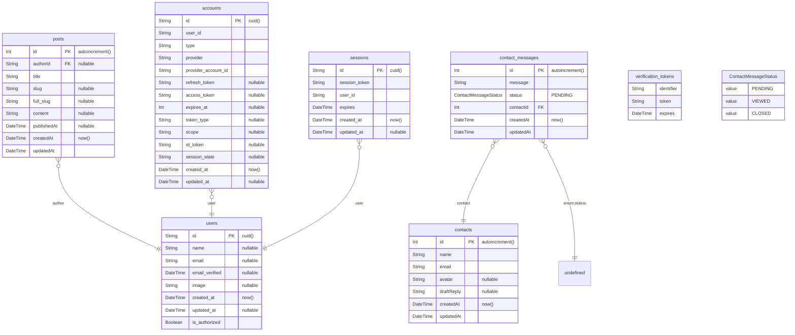

```mermaid
erDiagram
	posts {
		Int id PK  "autoincrement()"
		String authorId FK  "nullable"
		String title
		String slug  "nullable"
		String full_slug  "nullable"
		String content  "nullable"
		DateTime publishedAt  "nullable"
		DateTime createdAt  "now()"
		DateTime updatedAt
	}
	contacts {
		Int id PK  "autoincrement()"
		String name
		String email
		String avatar  "nullable"
		String draftReply  "nullable"
		DateTime createdAt  "now()"
		DateTime updatedAt
	}
	contact_messages {
		Int id PK  "autoincrement()"
		String message
		ContactMessageStatus status "PENDING"
		Int contactId FK
		DateTime createdAt  "now()"
		DateTime updatedAt
	}
	accounts {
		String id PK  "cuid()"
		String user_id
		String type
		String provider
		String provider_account_id
		String refresh_token  "nullable"
		String access_token  "nullable"
		Int expires_at  "nullable"
		String token_type  "nullable"
		String scope  "nullable"
		String id_token  "nullable"
		String session_state  "nullable"
		DateTime created_at  "now()"
		DateTime updated_at  "nullable"
	}
	sessions {
		String id PK  "cuid()"
		String session_token
		String user_id
		DateTime expires
		DateTime created_at  "now()"
		DateTime updated_at  "nullable"
	}
	users {
		String id PK  "cuid()"
		String name  "nullable"
		String email  "nullable"
		DateTime email_verified  "nullable"
		String image  "nullable"
		DateTime created_at  "now()"
		DateTime updated_at  "nullable"
		Boolean is_authorized
	}
	verification_tokens {
		String identifier
		String token
		DateTime expires
	}
	ContactMessageStatus {
		value PENDING
		value VIEWED
		value CLOSED
	}
	posts }o--|| users : author
	contact_messages }o--|| contacts : contact
	contact_messages }o--|| undefined : "enum:status"
	accounts }o--|| users : user
	sessions }o--|| users : user

```
